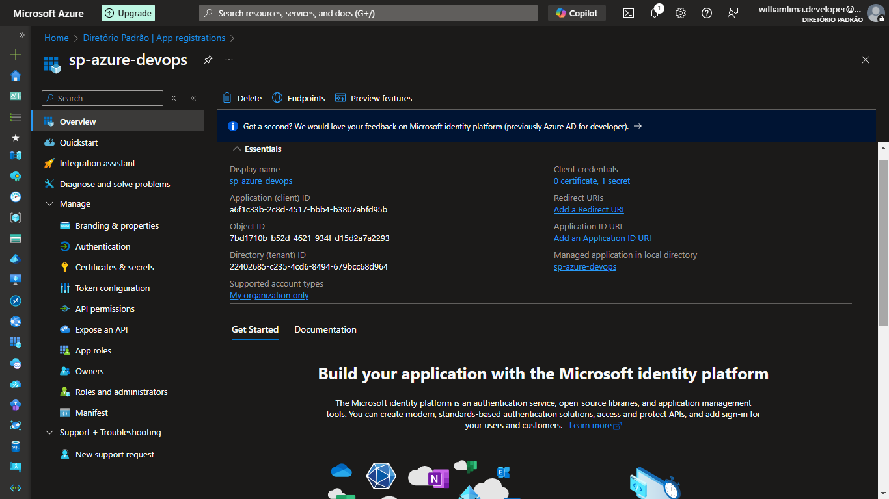
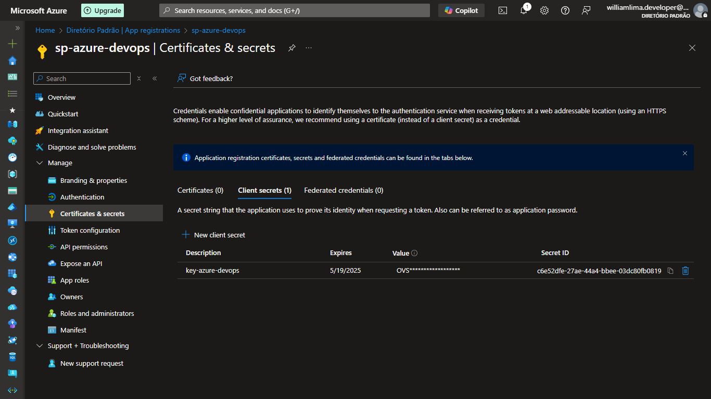
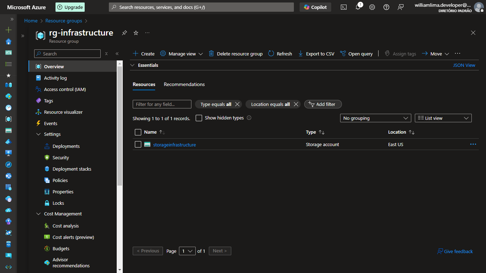
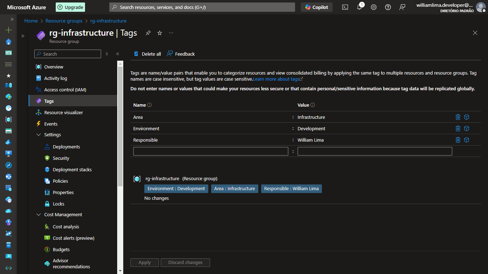
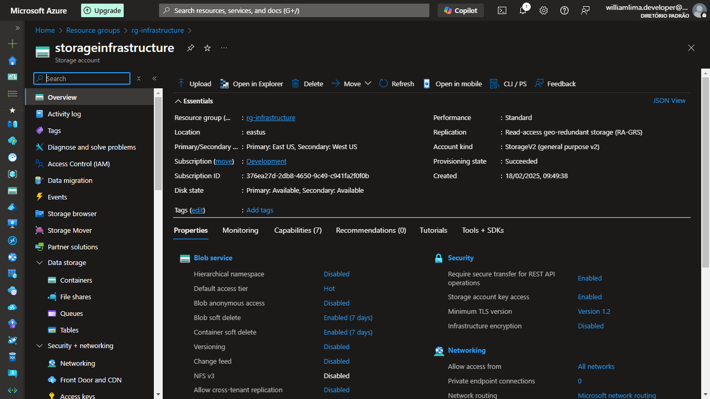
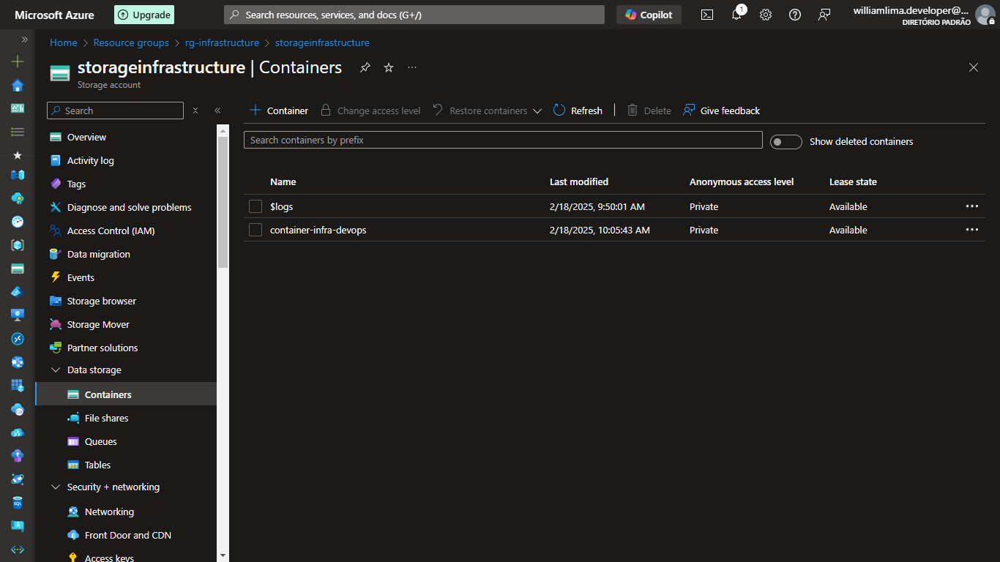
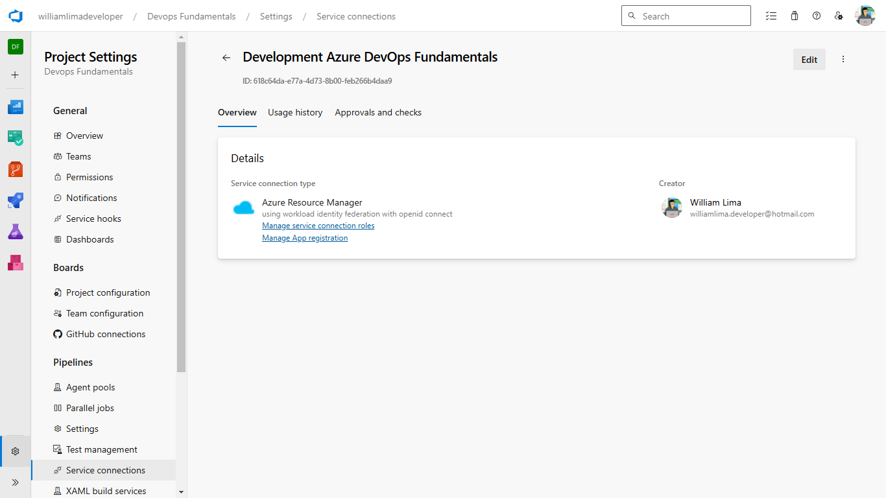

# DevOps Fundamentals - Azure Setup Challenge

Este repositório documenta o processo de configuração de uma infraestrutura básica na Azure, incluindo Service Principal, Resource Group e Storage Account.

## Processo de Configuração

### 1. Criação do Service Principal

#### O Service Principal foi criado com as seguintes configurações:

#### Configuração de certificados e secrets:

### 2. Resource Group

#### Criação do Resource Group para hospedar os recursos:

#### Adição de tags para melhor organização:

### 3. Storage Infrastructure

#### Configuração da infraestrutura de armazenamento:

#### Criação do container de armazenamento:

### 4. Azure DevOps Integration

#### Configuração da conexão de serviço no Azure DevOps:

## Requisitos

- Conta ativa na Azure
- Permissões adequadas para criar recursos
- Azure DevOps configurado

## Observações

- Todos os recursos foram criados seguindo as melhores práticas de segurança
- As tags foram aplicadas para melhor gerenciamento de custos e recursos
- O Service Principal possui as permissões mínimas necessárias para operação
